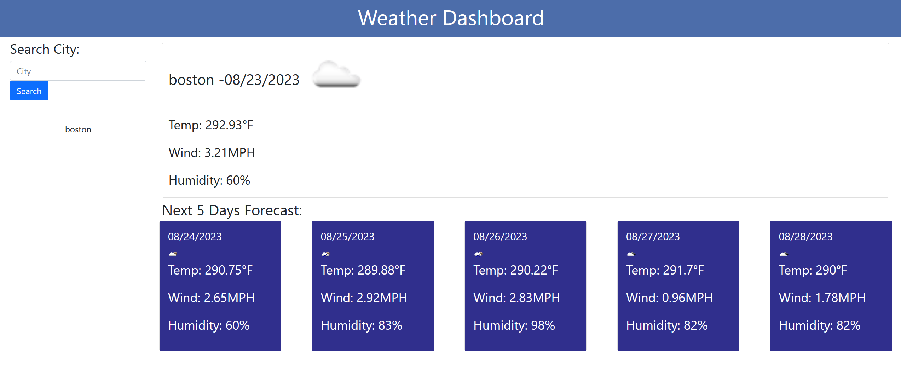

# WeatherDashboard6

## Description

The goal of this project is to learn how to use server-side APIs. Data should be pulled from the Weather API by using the fetch function in JS and add it to the page. 

Screenshots of webpage:

##

Link to the repository: https://github.com/YC937/WeatherDashboard6

Link to the deployed website: https://yc937.github.io/WeatherDashboard6/

## License

  
This application is under the [MIT License](https://opensource.org/licenses/MIT).

&copy;Copyright YM C
